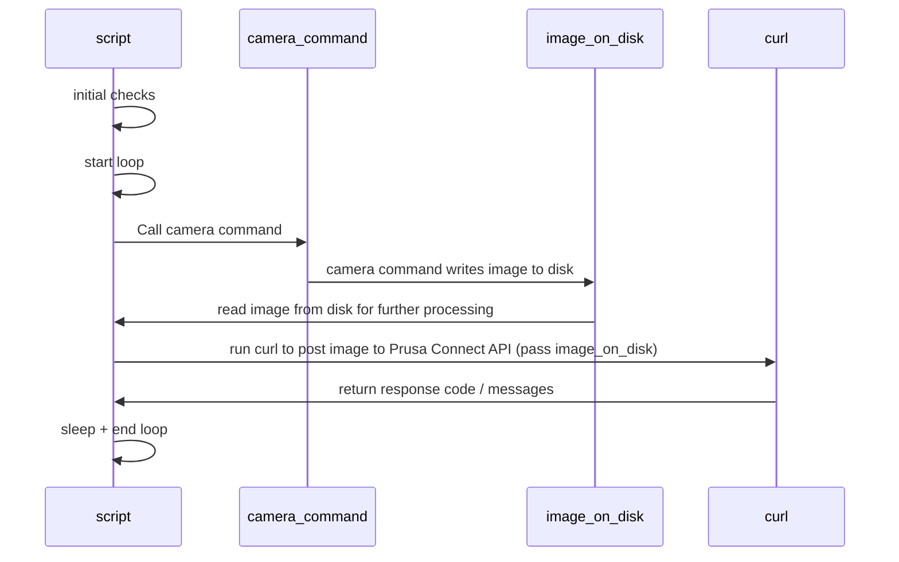

# prusa-connect-camera-script


Linux shell script to send still camera images to Prusa Connect

## Known limitations

- TODO: camera pre-configuration is not yet supported
  (such as fixed white balance etc)
- this script performs processing of the single camera, if you need more cameras
  then just create multiple copies with different settings (see below)
- TODO: remote streams such as RTSP via ffmpeg
- Rpi Zero W or older devices may have CPU limitations to process remote streams
  or multiple cameras at once

- I was not able to test EVERY setting so this may still have some bugs
- Prusa Connect will not show camera image if the printer is not alive, this is
  Prusa Connect limitation.
- default settings are quire generic and thus low camera quality, you need to adjust
  them, see advanced configuration at the end

## Supported devices

- Raspberry Pi CSI cameras such as [Raspberry Pi Cam](https://www.raspberrypi.com/documentation/accessories/camera.html)
- most of USB cameras if they work under Linux
- esphome cameras using `esp32_camera_web_server` with `snapshot` module
- esphome cameras using `esp32_camera_web_server` with `stream` module using `ffmpeg`

## Requirements

- (Raspberry Pi) depending on the device you may need to enable camera in the `raspi-config`,
  aslo I recommend some modern operating system (for example standard
  Raspberry Pi OS Lite)
- for USB cameras please install `fswebcam` package
- generic system packages:
  - `bash` 5.x (what year is it?)
  - `git` (just to install scripts from this repo)
  - `curl`
  - `iputils-ping`

- optional packages:
  - `v4l-utils` - to detect camera capabilities
  - `libraspberrypi-bin` or `rpicam-apps-lite` for Rpi CSI cameras
  - `fswebcam` - for generic USB cameras
  - `ffmpeg` - for custom commands for capturing remote streams
  - you-name-it - for custom commands beyond my imagination

## Architecture



## Installation

Install system packages (assuming Debian based distros on Raspbery Pi OS):

```shell
sudo apt-get update
sudo apt-get install -y curl fswebcam
```

Download this script and prepare service.

```shell
ssh pi@your-device
mkdir -p /home/pi/src
cd /home/pi/src
git clone https://github.com/nvtkaszpir/prusa-connect-camera-script.git
cd prusa-connect-camera-script
sudo cp -f prusa-connect-camera@.service /etc/systemd/system/prusa-connect-camera@.service
sudo systemctl daemon-reload

```

## Configuration

Configs are passed as environment vars.

For more in-depth details (no need to repeat them here) please see the top of
the [prusa-connect-camera.sh](./prusa-connect-camera.sh).

## Adding new camera

Short overview of actions:

- ensure printer is up and running and sending status to Prusa Connect
  (otherwise images will be discarded)
- add new camera to the existing printer in Prusa Connect, obtain token
- create config for prusa-connect-camera-script env vars
- test the config
- install script as service

### Create new camera in the Prusa Connect

- go to [Prusa Connect](https://connect.prusa3d.com/) and log in
- select Printer
- select Camera
- on the bottom click `Add new other camera`
- new camera is created, copy Token, this is needed later

## Create config for prusa-connect-camera-script env vars

There are some example configs depending on what camera you have.

- `csi.dist` - for CSI attached cameras via ribbon to Raspberry Pi
- `usb.dist` - for generic USB cameras attached via USB to any linux device
- `esphome-shapshot.dist` - for generic esphome with camera + web component
- `esphome-stream.dist` - for generic esphome with camera + web component

Notice that each camera should have different fingerprint and token.
Do not change fingerprint after launching the script - thus camera is registered
and you may need to revert the change or delete and readd camera again and start
from scratch.

How to get info which cameras are available?
Run `v4l2-ctl --list-devices`

How to get what modes are available for the camera?
Run `v4l2-ctl --list-formats-ext -d /dev/video0` where `/dev/video0` is a device
listed from command above, notice not every device is an actual camera.

### CSI camera on Raspberry Pi

Depending on the operating system you have you need to choose between
`csi.dist` (libcamera or rpicam-still) or `csi-legacy.dist` (raspistill).

Example for newer operating systems (libcamera or rpicam-still):

- copy `csi.dist` as `.csi` if you want to use Raspberry Pi camera
- in copied file `.csi` replace `token-change-me` with the value of the token
  you copied
- in copied file `.csi` replace `fingerprint-change-me` with some random value,
  which is alphanumeric and has at least 16 chars (and max of 40 chars),
  for example set it to `fingerprint-myprinter-camera-1`
- save edited file `.csi`
- go to [Test the config](#test-the-config)

Example for older operating systems with raspistill:

- copy `csi-legacy.dist` as `.csi` if you want to use Raspberry Pi camera
- in copied file `.csi` replace `token-change-me` with the value of the token
  you copied
- in copied file `.csi` replace `fingerprint-change-me` with some random value,
  which is alphanumeric and has at least 16 chars (and max of 40 chars),
  for example set it to `fingerprint-myprinter-camera-1`
- save edited file `.csi`
- go to [Test the config](#test-the-config)

### USB camera

- copy `usb.dist` as `.usb`
- in copied file `.usb` replace `token-change-me` with the value of the token
  you copied
- in copied file `.usb` replace `fingerprint-change-me` with some random value,
  which is alphanumeric and has at least 16 chars (and max of 40 chars),
  for example set it to `fingerprint-myprinter2-camera-2`
- save edited file `.usb`
- go to [Test the config](#test-the-config)

### ESPHome camera snapshot

With esphome we can use the ultimate power of `curl` command to fetch the image
from the camera :D

- install esphome [camera](https://esphome.io/components/esp32_camera.html)
  on the device and add `esp32_camera` and `esp32_camera_web_server` with
  `snapshot` modules:

  ```yaml
  esp32_camera:
  ... (skipped due to the fact there are different modules)

  esp32_camera_web_server:
    - port: 8081
      mode: snapshot
  ```

- copy `esphome-snapshot.dist` as `.esphome-snapshot`
- in copied file `.esphome-snapshot` replace `token-change-me` with the value
  of the token you copied
- in copied file `.esphome-snapshot` replace `fingerprint-change-me` with some
  random value, which is alphanumeric and has at least 16 chars (and max of 40 chars),
  for example set it to `fingerprint-myprinter3-camera-3`
- in copied file `.esphome-snapshot` replace your esphome device address and port
  in `CAMERA_COMMAND_EXTRA_PARAMS`
- save edited file `.esphome-snapshot`
- go to [Test the config](#test-the-config)

### ESPHome camera stream

With esphome we can use the `ffmpeg` to fetch the image from the camera:

- install esphome [camera](https://esphome.io/components/esp32_camera.html)
  on the device and add `esp32_camera` and `esp32_camera_web_server` with
  `stream` modules:

  ```yaml
  esp32_camera:
  ... (skipped due to the fact there are different modules)

  esp32_camera_web_server:
    - port: 8080
      mode: stream
  ```

- copy `esphome-stream.dist` as `.esphome-stream`
- in copied file `.esphome-stream` replace `token-change-me` with the value
  of the token you copied
- in copied file `.esphome-stream` replace `fingerprint-change-me` with some
  random value, which is alphanumeric and has at least 16 chars (and max of 40 chars),
  for example set it to `fingerprint-myprinter3-camera-3`
- in copied file `.esphome-stream` replace your esphome device address and port
  in `CAMERA_COMMAND_EXTRA_PARAMS`
- notice that `-update 1` may not be needed in certain ffmpeg versions
- save edited file `.esphome-stream`
- go to [Test the config](#test-the-config)

## RTSP cameras

### Caution

**DO NOT use VLC to test streams**, there are unfortunately problems with it.
Please use `ffplay` from `ffmpeg` package.

### mediamtx

Assuming you run [mediamtx with Raspberry Pi CSI camera](https://github.com/bluenviron/mediamtx#raspberry-pi-cameras)
and that `raspberry-pi` is the hostname of your device and that you expose two cams:

- CSI Rasberry Pi camera
- USB camera

so your `mediamtx.yml` has config fragment such as:

```yaml
paths:
  cam:
    source: rpiCamera

  endoscope:
    runOnInit: ffmpeg -f v4l2 -i /dev/video1 -pix_fmt yuv420p -preset ultrafast -b:v 600k -f rtsp rtsp://localhost:$RTSP_PORT/$MTX_PATH
    runOnInitRestart: yes

```

You have some options such as TCP or UDP stream (whatever..).
This should work with any other camera (usually there is a different port)

You should be able to test the stream locally with `ffplay` command.
For example, if you use mediamtx config above then:

```shell
ffplay rtsp://raspberry-pi:8554/cam
ffplay rtsp://raspberry-pi:8554/endoscope
```

should show window with the image stream for each device.

If that works, then configuration should be pretty straightforward:

- copy `ffmpeg-mediamtx-rtsp-tcp.dist` as `.ffmpeg-mediamtx-rtsp-tcp`
- in copied file `.ffmpeg-mediamtx-rtsp-tcp` replace `token-change-me` with the value
  of the token you copied
- in copied file `.ffmpeg-mediamtx-rtsp-tcp` replace `fingerprint-change-me`
  with some random value, which is alphanumeric and has at least 16 chars
  (and max of 40 chars), for example set it to `fingerprint-myprinter4-camera-4`
- in copied file `.ffmpeg-mediamtx-rtsp-tcp` replace your RTSP device address `raspberry-pi`,
  port and stream identificator in `CAMERA_COMMAND_EXTRA_PARAMS` if needed
- save edited file `.ffmpeg-mediamtx-rtsp-tcp`
- go to [Test the config](#test-the-config)

You can try with UDP, but you may not get it ;-)

## Test the config

- ensure to turn on the 3D Printer so that it sends telemetry, otherwise images
  will sent and you will get successful image uploads but on PrusaConnect page
  they will not be available
- run below commands, we assume `.env` is the camera config we defined earlier

```shell
set -o allexport; source .env; set +o allexport
./prusa-connect-camera.sh
```

Above commands will load env vars and will start the script.
In the beginning script shows some commands that will be executed, for example
command to fetch the image from camera, example log line:

```text
Camera capture command: fswebcam -d /dev/video0 --resolution 640x480 --no-banner /dev/shm/camera_87299de9-ea57-45be-b6ea-4d388a52c954.jpg
```

so you should be run:

```shell
fswebcam -d /dev/video0 --resolution 640x480 --no-banner /dev/shm/camera_87299de9-ea57-45be-b6ea-4d388a52c954.jpg
```

and get the outputs from the command, and an image.

Check for errors, if any, if everything is ok you should see a lot of `204`
every 10s.

If not, well, raise an issue on GitHub.

## Install script as service

Depending on the distro there are various options to configure scripts as service

### Configure service with systemd

This project allows spawning multiple systemd units.
The suffix after `@` defines what env file to load from givven path.
For example if you set unit file name to `prusa-connect-camera@csi.service`
then systemd will load env vars from the file under path
`/home/pi/src/prusa-connect-camera-script/.csi`

So in short:

- copy `csi.dist` as `.csi` and edit it
- copy `prusa-connect-camera@.service` as `prusa-connect-camera@csi.service`
- you may additionally edit unit file if you use different config paths
- run systemctl daemon-reload
- enable systemd service
- start systemd service

```shell
cd /home/pi/src/prusa-connect-camera-script/
cp csi.dist .csi
# edit .csi and set custom command params, token and fingerprint etc...
sudo systemctl enable prusa-connect-camera@csi.service
sudo systemctl start prusa-connect-camera@csi.service
sudo systemctl status prusa-connect-camera@csi.service
```

For another camera, let say for another camera attached over USB

```shell
cd /home/pi/src/prusa-connect-camera-script/
cp usb.dist .usb1
# edit .usb1 and set device, token and fingerprint etc...
sudo systemctl enable prusa-connect-camera@usb1.service
sudo systemctl start prusa-connect-camera@usb1.service
sudo systemctl status prusa-connect-camera@usb1.service
```

For esphome camera, for static images:

```shell
cd /home/pi/src/prusa-connect-camera-script/
cp esphome-snapshot.dist .esphome1
# edit .esphome1 and set device, token and fingerprint etc...
sudo systemctl enable prusa-connect-camera@esphome1.service
sudo systemctl start prusa-connect-camera@esphome1.service
sudo systemctl status prusa-connect-camera@esphome1.service
```

## Advanced configuration

### Getting higher quality camera images

Use `v4l2-ctl` to get the list of available resolutions that camera provides
and then update it in the env var configs. Test changes.
Notice that Prusa Connect has file size limit something about 8MB of the image uploaded.

For Raspberry Cam v2 you could use `csi.dist` as ssource and add
`--mode 2592:1944:12:P` to the CAMERA_COMMAND_EXTRA_PARAMS.

For certain USB cameras (such as Tracer Endoscope) you shoudl use `usb.dist` and
you should be able to add `--resolution 1280x960` to the CAMERA_COMMAND_EXTRA_PARAMS.

## Performance

- Raspberry Pi Zero W is able to process CSI camera (Rpi Cam v2) and USB 2k camera
  but it has load average about 1.4, and CPU is quite well utilized, so you may
  need to decrease resolution per camera to see how it goes.
- ffdshow is usually noticeably slow and cpu intensive.

## Todo other

- TODO: add fake prusaconnect POST messages to keep printer 'always on'?
