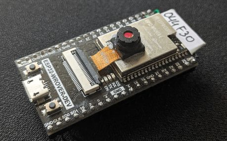

# ESPHome camera stream



With esphome camera stream we can use the `ffmpeg` to fetch the image from the
camera stream. It requires a bit more computing power from esp device and the
host that runs the image processing.

Notice that this is not recommended way due to the amount of consumed resources.

## Prepare esphome device

Configure esphome device:

- install esphome [camera](https://esphome.io/components/esp32_camera.html)
  on the device and add `esp32_camera` and `esp32_camera_web_server` with
  `stream` modules:

  ```yaml
  esp32_camera:
  ... (skipped due to the fact there are different modules)

  esp32_camera_web_server:
    - port: 8080
      mode: stream
  ```

Flash the device and wait until it boots and is available.

## Create config for script

- copy `esphome-stream.dist` as `.env`
- in copied file `.env` replace `token-change-me` with the value
  of the token you copied
- in copied file `.env` replace `fingerprint-change-me` with some
  random value, which is alphanumeric and has at least 16 chars (and max of 40 chars),
  for example set it to `fingerprint-myprinter3-camera-3`
- in copied file `.env` replace your esphome device address and port
  in `CAMERA_COMMAND_EXTRA_PARAMS`
- notice that `-update 1` may not be needed in certain ffmpeg versions
- save edited file `.env`

Next, [test config](./test.config.md).

## Real world example

The same ESP device with stream, notice different port (`8080`).

<!-- markdownlint-disable line_length -->
```shell
PRINTER_ADDRESS=127.0.0.1
PRUSA_CONNECT_CAMERA_TOKEN=token-change-me
PRUSA_CONNECT_CAMERA_FINGERPRINT=f68336b-8dab-42cd-8729-6abd8855ff63
CAMERA_DEVICE=/dev/null
CAMERA_COMMAND=ffmpeg
CAMERA_COMMAND_EXTRA_PARAMS="-y -i 'http://esp32-wrover-0461c8.local:8080/' -vframes 1 -q:v 1 -f image2 -update 1 "
```
<!-- markdownlint-enable line_length -->
