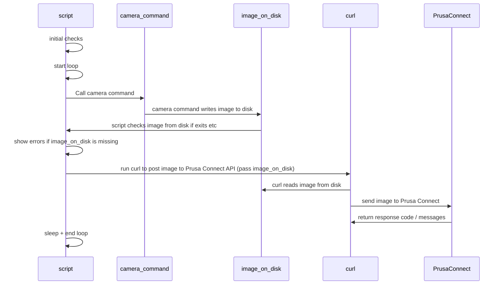

# Welcome to Prusa-Connect-Camera-Script

This project aims to make it easier to use any camera to be used as
Prusa Connect camera.

## Features

- allows to read images from CSI cameras, USB cameras, RTSP streams, still images...
- do not send pictures if the printer is offline
- store data in memory to prevent MicroSD wear out
- verbose error messages to see if the image capture works
- ability to run multiple cameras in separate instances
- ability to run in docker containers (multi-platform  multi-arch)

## Architecture

## Known limitations

- this script performs processing of the single camera, if you need more cameras
  then just create multiple copies with different settings (see below)
- Rpi Zero W or older devices may have CPU limitations to process remote streams
  or multiple cameras at once

- I was not able to test EVERY setting so this may still have some bugs
- Prusa Connect will not show camera image if the printer is not alive, this is
  Prusa Connect limitation.
- default settings are quire generic and thus low camera quality, you need to adjust
  them, see advanced configuration at the end
